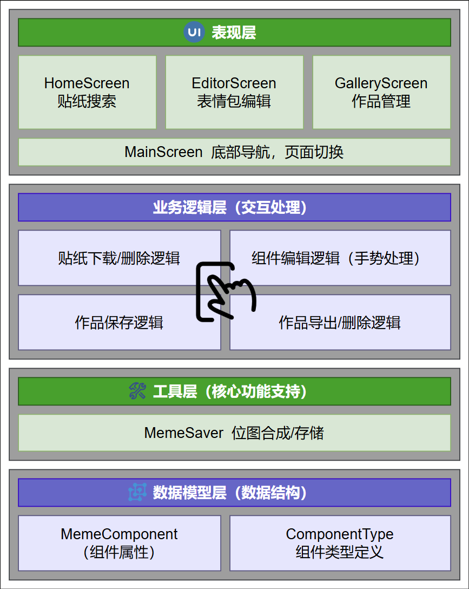

### 1. 产品功能介绍
该应用是一款表情包创作与管理工具，核心功能包括：

- **贴纸资源获取**：支持通过关键词搜索网络贴纸（集成搜狗图片接口），可下载至本地并管理（下载/删除已下载贴纸）。
- **表情包编辑**：
    - 上传本地图片作为底图；
    - 添加文字组件（支持编辑内容、颜色、拖拽、缩放、旋转）；
    - 添加贴纸组件（支持本地内置贴纸、已下载的网络贴纸，同样支持拖拽、缩放、旋转）。
- **作品管理**：
    - 保存编辑完成的表情包至应用私有存储；
    - 在“作品仓库”预览已保存作品；
    - 将作品导出至系统相册（兼容Android Q及以上版本的媒体库存储机制）；
    - 删除不需要的作品。

### 2. 程序概要设计
#### （1）模块划分
- **UI层**：负责用户界面展示与交互，包含4个核心页面：
    - `HomeScreen`：贴纸搜索、下载与管理页面；
    - `EditorScreen`：表情包编辑页面（核心交互页）；
    - `GalleryScreen`：已保存作品的展示与管理页面；
    - `MainScreen`：底部导航控制器，管理页面切换。

- **数据模型层**：定义核心数据结构：
    - `MemeComponent`：封装表情包组件（文字/贴纸）的属性（位置、缩放、旋转、类型等）；
    - `ComponentType`：密封类，区分组件类型（文字、本地贴纸、远程/本地Uri贴纸）。

- **工具层**：提供核心功能支持：
    - `MemeSaver`：负责位图合成（底图+组件）、保存至内部存储、导出至系统相册。

#### （2）核心流程
1. **贴纸下载流程**：
    - 用户在`HomeScreen`输入关键词搜索，通过`fetchFromSogou`接口获取网络贴纸URL；
    - 点击未下载贴纸，通过`downloadSticker`将图片保存至`files/downloaded_stickers`目录；
    - 长按已下载贴纸可通过`deleteSticker`删除本地文件。

2. **表情包编辑流程**：
    - 用户选择本地图片作为底图；
    - 添加文字/贴纸组件，通过手势交互（拖拽、缩放、旋转）调整组件属性（实时更新`MemeComponent`状态）；
    - 点击“保存到仓库”，调用`MemeSaver.createBitmap`合成最终位图，再通过`saveToInternalStorage`保存至`files/my_memes`目录。

3. **作品管理流程**：
    - `GalleryScreen`加载`files/my_memes`目录下的图片文件并展示；
    - 点击作品预览，支持导出至系统相册（`MemeSaver.exportToSystemGallery`）或删除文件。

#### （3）数据存储设计
- **私有存储**：
    - 下载的贴纸：`files/downloaded_stickers/`（以MD5哈希生成唯一文件名）；
    - 保存的作品：`files/my_memes/`（以“Meme_时间戳.jpg”命名）。
- **系统相册导出**：Android Q及以上保存至`DCIM/MemeMaster`目录，低版本通过媒体库接口插入。

### 3. 软件架构图

  

### 4. 技术亮点及其实现原理

#### （1）高清位图合成技术
- **亮点**：保证编辑后的表情包画质无损，组件（文字/贴纸）与底图精准融合。
- **实现原理**：
    - 在`MemeSaver.createBitmap`中，基于原始底图尺寸创建可编辑位图（`baseBitmap.copy`），避免缩放导致的画质损失；
    - 计算屏幕编辑区域与原始底图的缩放比例（`scale`）和偏移量（`dx`/`dy`），将用户在屏幕上的操作坐标（DP单位）转换为原始底图的像素坐标（`finalX`/`finalY`）；
    - 组件绘制时，根据转换后的坐标应用位置、旋转、缩放变换，确保组件在原始底图上的比例和位置准确。

#### （2）流畅的组件交互体验
- **亮点**：支持组件（文字/贴纸）的拖拽、缩放、旋转等精细化操作，响应流畅。
- **实现原理**：
    - 在`EditorScreen`中，使用Compose的`transformable`修饰符监听双指缩放和旋转手势，通过`detectDragGestures`监听单指拖拽；
    - 实时更新`MemeComponent`的`offset`（位置）、`scale`（缩放）、`rotation`（旋转）状态，Compose自动根据状态变化重组UI，实现操作的即时反馈；
    - 选中组件时显示边框和删除按钮，通过`pointerInput`区分单击（选中）和双击（编辑文字）手势。

#### （3）跨版本存储适配
- **亮点**：兼容Android Q（API 29）及以上的分区存储机制，同时支持低版本系统。
- **实现原理**：
    - 应用私有存储（`context.filesDir`）用于保存下载的贴纸和作品，不受分区存储限制；
    - 导出至系统相册时，Android Q及以上通过`MediaStore`的`RELATIVE_PATH`指定`DCIM/MemeMaster`目录，低版本直接插入媒体库；
    - 使用`ContentResolver`获取输出流（`openOutputStream`）写入图片，避免直接操作外部存储路径。

#### （4）高效的图片加载与缓存
- **亮点**：快速加载本地/网络图片，减少重复下载和内存占用。
- **实现原理**：
    - 使用Coil库的`AsyncImage`加载图片，自动处理内存缓存和磁盘缓存，支持本地文件、网络URL、资源ID等多种数据源；
    - 网络贴纸加载之后会通过管理单例缓存，从而防止切换页面导致的多次重复网络请求
    - 网络贴纸下载后以MD5哈希命名保存至本地，通过`getDownloadedFileNames`跟踪已下载文件，避免重复下载；
    - 贴纸和作品列表使用`LazyVerticalGrid`/`LazyRow`实现懒加载，仅渲染可见项，优化性能。

#### （5）状态驱动的UI设计
- **亮点**：通过状态管理实现UI与数据的联动，简化交互逻辑。
- **实现原理**：
    - 使用Compose的`mutableStateOf`/`mutableStateListOf`定义可观察状态（如`components`组件列表、`selectedImageUri`选中的底图）；
    - 状态变化时，依赖该状态的UI组件（如组件渲染、列表展示）自动重组，无需手动更新视图。